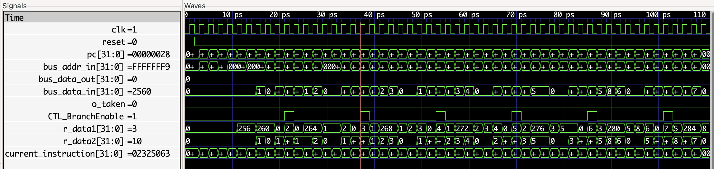

# SystemVerilog RISC-V Core

Aim: Implement 5-stage pipelined RSIC-V core (RV32I subset) using SystemVerilog, with these extensions:
- Hazard Unit
- Branch Prediction
- MMIO
- UART, SPI, I2C support

## Single Cycle Implementation
Control signals can be found in [CONTROL-SC.md](docs/CONTROL-SC.md).
### Waveform (GTKWave)

## TODO Modules
- [x] ALU
- [x] Register file
- [x] Branch Unit
- [x] Immediate Generator
- [x] ALU Control
- [x] Instruction Memory
- [x] Data Memory
- [x] Program Counter
- [x] Datapath
- [x] Control Unit
- [ ] Pipelines
- [ ] Hazard Unit

## TODO
1) Add checks for `TEXT_MEM_BEGIN` and `DATA_MEM_BEGIN` memory ranges in `dmem` and `imem`.