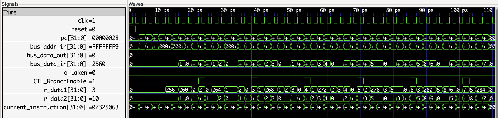
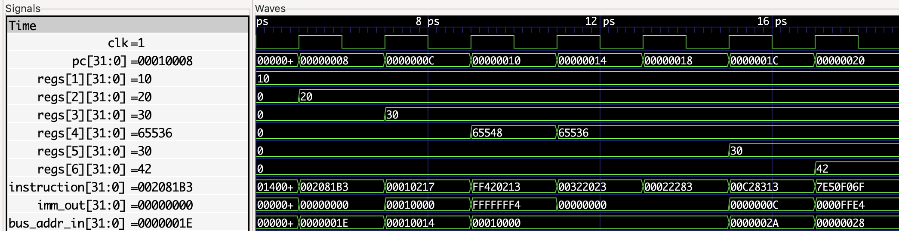
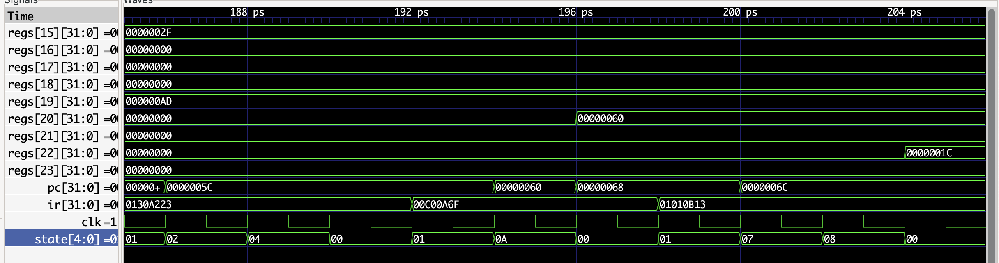

# SystemVerilog RISC-V Core

Aim: Implement 5-stage pipelined RSIC-V core (RV32I subset) using SystemVerilog, with these extensions:
- Hazard Unit
- Branch Prediction
- MMIO
- UART, SPI, I2C support

## Single Cycle Implementation
Control signals can be found in [CONTROL-SC.md](docs/CONTROL-SC.md).
### Waveform (GTKWave)
[mem/fib.hex](mem/fib.hex):

[mem/testadd.hex](mem/testadd.hex)

## Multicycle Implementation
Control unit implemented as a FSM (TODO: Diagram)

### Waveform (GTKWave)
[mem/test_rv32i.hex](mem/test_rv32i.hex)

As can be seen from the waveform, the JAL instruction (assembled `0x00C00A6F`) is located at PC `0x5C`, undergoes states `FETCH` -> `DECODE` -> `JAL` -> `FETCH` ...

During the `JAL` state, `PC+4` is written to register `x20`, as can be verified from the test program [asm/test_rv32i.s](asm/test_rv32i.s).

**Note**: `PC <= PC + 4` assignment is done at the `DECODE` state, due to branching instructions need the *unmodified* PC (i.e. *old* PC without incremented by 4).

## TODO Modules
- [x] ALU
- [x] Register file
- [x] Branch Unit
- [x] Immediate Generator
- [x] ALU Control
- [x] Instruction Memory
- [x] Data Memory
- [x] Program Counter
- [x] Datapath
- [x] Control Unit
- [ ] Pipelines
- [ ] Hazard Unit

## TODO
1) Add checks for `TEXT_MEM_BEGIN` and `DATA_MEM_BEGIN` memory ranges in `dmem` and `imem`.
