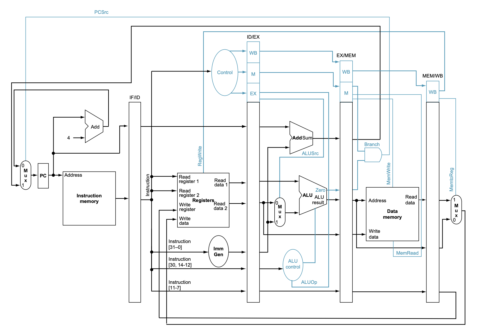

# SystemVerilog RISC-V Core

Aim: Implement 5-stage pipelined RSIC-V core (RV32I ISA subset) using SystemVerilog, with these extensions:
- Hazard Unit
- Branch Prediction
- etc...

## TODO Modules
- [x] ALU
- [x] Register file
- [x] Branch Unit
- [x] Immediate Generator
- [ ] ALU Control
- [ ] Control Unit
- [ ] Instruction Memory
- [ ] Data Memory
- [ ] Program Counter
- [ ] Datapath
- [ ] Pipelines
- [ ] Hazard Unit